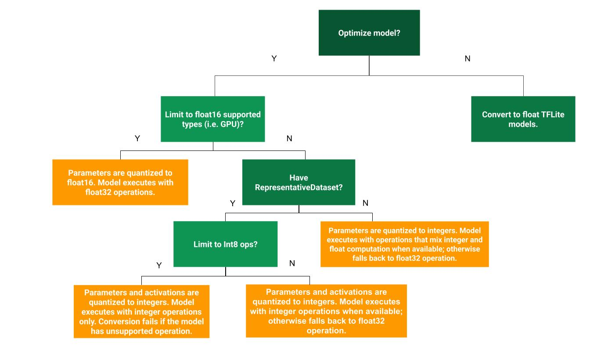

AUTHOR: DAVID TENA GAGO

This repo is intended to use a set of tools for converting a TensorFlow-based model into a TensorFlow Lite-based model to be deployed in a Micro-Controller Unit (MCU)

The repo is structured as follows:
```text
├── dataset                     # Datasets for more accurate model conversion, validation, etc.
├── helpers                     # Tools for conversion, pruning, etc.
├── model                       # Directory containing the model(s) to be converted. Each model should have its own directory
├── main.py                     # Main file for pruning/quantizing/converting a given model
```

The idea behind this repo is to use when you already have a TensorFlow model and want to convert it to TF-Lite. It is noted that, when this conversion happens, some of the operations supported in TensorFlow are not supported in TensorFlow Lite, and therefore an approximation of the same operation is translated into the TF-Lite version of the converted model. As a result, the model exhibits a poorer accuracy. However, this just happens with certain layers, for instance LSTM layers. For most models, it should do good.

It is possible, however, to create your own conversion rules for specific operations, which might be better than the default ones. In particular, I had problems when converting LSTM layers. Maybe this is solved in future tensor flow and tensorflow lite versions. 

This repo allows to perform, apart from the simple conversion from TensorFlow to TensorFlow Lite, two possible optimisation:
- **Pruning**
- **Quantization**

**NOTE**: Another possible optimisation is to perform **weight clustering**, which consists on reducing the number of unique weights by transforming model's weights into repeated values across the original weights. It is similar to pruning, but I have not contrasted the performance, neither its application is considered in this repo.

**NOTICE**: at 20th October 2023, using tensorflow version 2.13.1 and tensorflow-model-optimisation version 0.7.5, LSTM layers can't yet be converted using post-training quantization without a certain accuracy loss. As for quantization-aware training, it never could be performed for LSTM layers due to incompatibilities.

## Pruning

Pruning is the process of "canceling" certain neurons in the model. This happens because, certain neuron's weights are very close to 0, and this causes the model to have unnecessary bias that by converting it to 0, can be eliminated. This makes the model less complex, and besides, multiplying by 0 is faster, so the overall model inference is faster.

When pruning, it is important to be aware of the term *sparsity*, which can be defined as the percentage of neurons in a model whose weight is 0. Basically, when pruning, you retrain the model for much fewer epochs than in normal training to gain sparsity. However, excessive pruning can lead to losing the model's ability to understand the data. To overcome this, you have to finetune your pruning process and/or select specific layers of the model to be pruned, trying to leave non pruned those critical layers for the model.

Follow these articles to understand more how the process works, how a pruned model can be exported and deployed, etc.:
- [TensorFlow - Pruning comprehensive guide](https://www.tensorflow.org/model_optimization/guide/pruning/comprehensive_guide.md)
- [TensorFlow - Simple pruning example](https://www.tensorflow.org/model_optimization/guide/pruning/pruning_with_keras)

## Quantization

Quantization consists on expressing the model's neurons weights as either 8-bit or 16-bit long weights. In this way, the model can be less complex and can be much lighter and faster. However, there's an obvious downgrade in the model accuracy.

There are two forms of quantization: post-training quantization and quantization aware training. Post-training quantization is easier to use, though quantization aware training is often better for model accuracy.

### Post-training quantization
It is generally recommend to use quantization with 16-bit floats for GPU acceleration and 8-bit integer for CPU execution. The following decision tree can help determine which post-training quantization method is best for your use case:

|        **Technique**       |         **Benefits**         |           **Hardware**          |
|:--------------------------:|:----------------------------:|:-------------------------------:|
| Dynamic range quantization |   4x smaller, 2x-3x speedup  |               CPU               |
|  Full integer quantization |    4x smaller, 3x+ speedup   | CPU, Edge TPU, Microcontrollers |
|    Float16 quantization    | 2x smaller, GPU acceleration |             CPU, GPU            |



You can know more in:
- [TensorFlow - Post-training quantization](https://www.tensorflow.org/lite/performance/post_training_quantization)

**IMPORTANT**: When a model is quantized, so should be its input and output, so have in mind that you have to transform the data you feed into the model for deployment as well as the resulting model inference value. For instance, assuming a quantized model:
```python
def evaluate():
    import numpy as np
    import tensorflow as tf

    # Load models
    model = tf.lite.Interpreter(model_path="../whatever.h5")
    model.allocate_tensors()
    input_details = model.get_input_details()
    output_details = model.get_output_details()

    print("Model input shape: " + str(input_details[0]["shape"]))
    model_input_type = input_details[0]["dtype"]
    print("Model input data type : " + str(model_input_type))

    input_scale, input_zero_point = input_details[0]["quantization"]
    output_scale, output_zero_point = output_details[0]["quantization"]

    # Load dataset
    dataset = load_dataset() #  whatever dataset
    model_output_type = dataset.dtype

    # dataset preprocessing to use it in the same way it was trained
    dataset = preprocess_dataset() # if necessary

    for i in range(len(dataset)):
        X = np.array(dataset[i]) # reshape as needed

        # quantize input:
        X = X / input_scale + input_zero_point
        X = X.astype(model_input_type)

        # perform models inference
        model.set_tensor(input_details[0]["index"], X)
        model.invoke()
        y_predict = model.get_tensor(output_details[0]["index"])[0][0] #  models output

        # de-quantize output:
        y_predict = (y_predict - output_zero_point) * output_scale
        y_predict = y_predict.astype(model_output_type)

        print("Prediction result: ", y_predict)
```

### Quantization-aware training
It's used to train a model with the knowledge that it will be quantized later, so the model learns to accommodate quantization during training. you modify the model architecture to include fake quantization layers. These layers simulate the quantization process without actually quantizing the weights and activations. The training process involves backpropagation through these fake quantization layers. Essentially, the model learns to be robust to quantization errors. Learn more in [TensorFlow - Quantization-aware training](https://www.tensorflow.org/model_optimization/guide/quantization/training_example).

**NOTICE**: at 20th October 2023, the code for performing quantization-aware training is included in this repo, but it is not guaranteed it works as I never ended up using it given the conversion problems with LSTM layers. However, it should work for models without these layers.

## Usage

In order to use this repo, you have to have an already trained model (although it is not strictly necessary, but having an already fixed baseline to contrast results is very useful). This model has to be stored inside the ``/models`` directory of this project, in a separate directory. E.g., ``models/YOLOv3``. Moreover, this directory should contain, at least, the next info:

- Exported model: The model to convert/optimise in either if these two ways:
  - **tf_model**: Directory containing files of the exported model in protobuf format (preferred).
  - **<model_name>.h5**: Exported model but this time expressed as a .h5 format.
- **specs.json**: Json file containing information about model's training parameters, input, output, etc. Necessary when using the model to perform inference as this information will indicate how the input and output data will have to be transformed to use it in the same way as the model was trained with.
- **dataset**: Representative dataset of the data the model was trained with (if possible, the same dataset). Used for retraining and having more accurate conversion, and for pruning/quantization. The dataset should be in the shape of a .CSV file. where the last column is the labeling

Notice that this information is given when exporting the model following the procedures used in [this repo](https://gitavcn.uws.ac.uk/dtena/co2-predictor). Use it if necessary to export a model following that scheme.

When this is information is present, then you can run the main file of this project like:
```text
usage: main.py [-h] [--input_dir INPUT_DIR] [-e] [--export_dir EXPORT_DIR] [-p] [-q {integer_with_float_fallback,integer_with_8bits_weights_and_16bit_activations,int8,float16,None}] [--PTQ] [--QAT]
               [--plot_results]

optional arguments:
  -h, --help            show this help message and exit
  --input_dir INPUT_DIR
                        Input directory containing model data. E.g., models/YOLOv3/
  -e                    Flag to export final C-array model (this is the file that runs in a MCU)
  --export_dir EXPORT_DIR
                        Output file directory for exported model. Default: --input_dir/export
  -p, --prune           Flag to prune the model before quantization/conversion
  -q --quantization_type
                        Select which type of quantization to do for model conversion (default is None). Options:
                            - integer_with_float_fallback
                            - integer_with_8bits_weights_and_16bit_activations
                            - int8
                            - float16
                            - None
  --PTQ                 Enable Post-Training Quantization (PTQ). Incompatible with QAT
  --QAT                 Enable Quantization-Aware Training (QAT). Incompatible with PTQ
  --plot_results        Flag to plot the accuracy achieved by each of the generated models after conversion.
```


After the conversion, if option ``-e`` is selected, several files will be created:
  - The converted TF_lite model (whether it has been pruned or not)
  - The converted model in the shape of a C array. Used for inference in C
  - The converted model in the shape of a python object. Used for inference in micropython
  - A modified version of the specs file with the necessary information to quantize/dequantize an input and output when executing this model in an MCU.

In this way, you can do the same as in the code snipped shown in the quantization section of this readme to quantize/dequantize the input and output of the model but by checking the specs file instead of inspecting this attribute in the TF_lite model (which is not supported in micropython).

### Troubleshooting

Given the conversion errors when converting an LSTM model, I prepared an Excel file containing different combinations of conversion settings to see what's the output. This file is in ``config_combinations.ods``. Turns out, when pruning, the fewer epochs you prune for, the better the accuracy when converting. I don't know if this happens with non-LSTM models.

Furthermore, the final accuracy is arbitrary, and changes everytime you do the whole proces...

### Use case - CO2 Predictor export
The conversion of the CO2 predictor model installed in the lastest version of the FiPy Co-predictor has been created using the following syntax:

```
main.py --prune -e --plot_results --PTQ --input_dir $PROJECT_DIR$/models/lightweight_baby_tests/tf_model/
```
